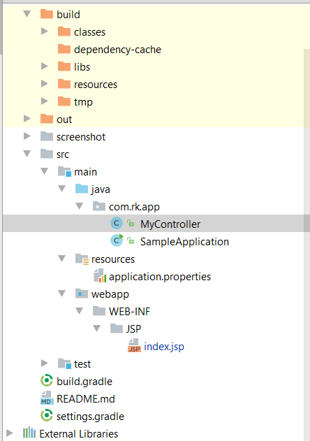

#springboot+tomcat+jsp
* 创建项目
    File-New-Project  
   
    
    
    
      
    创建完之后项目目录结构如下
     
    编辑gradle.build文件
```groovy
      group 'org.rk'
        version '1.0-SNAPSHOT'
        
        buildscript {
            ext {
                springBootVersion = '1.4.2.RELEASE'
            }
            repositories {
                mavenCentral()
            }
            dependencies {
                classpath("org.springframework.boot:spring-boot-gradle-plugin:${springBootVersion}")
            }
        }
        
        
        //用于编译好的源码打包成war文件
        apply plugin: 'war'
        //必须
        apply plugin: 'org.springframework.boot'
        
        
        
        war {
            baseName = 'SpringBoot'
            version = '0.0.1'
        }
        sourceCompatibility = 1.8
        
        repositories {
            mavenCentral()
        }
        
        dependencies {
            //spring-web
            compile('org.springframework.boot:spring-boot-starter-web')
            //jsp支持
            compile('org.apache.tomcat.embed:tomcat-embed-jasper')
            //jstl
            compile('javax.servlet:jstl')
            //tomcat外部tomcat容器中执行所需,用springboot运行可以不要
            providedRuntime("org.springframework.boot:spring-boot-starter-tomcat")
            //spring data-jpa
            compile group: 'org.springframework.boot', name: 'spring-boot-starter-data-jpa', version: '1.4.2.RELEASE'
            //mysql 驱动
            runtime('mysql:mysql-connector-java')
            testCompile('org.springframework.boot:spring-boot-starter-test')
        
        }
```

```java
    package com.rk.app;
    
    import org.springframework.stereotype.Controller;
    import org.springframework.web.bind.annotation.GetMapping;
    
    import java.util.Map;
    
    /**
     * Created by Administrator on 1/18/2017.
     */
    @Controller
    public class MyController {
    
        @GetMapping("/index")
        public String index(Map<String, Object> model){
            model.put("msg","welocme");
            return "index";
        }
    }

```
```java
package com.rk.app;

import org.springframework.boot.SpringApplication;
import org.springframework.boot.autoconfigure.SpringBootApplication;
import org.springframework.boot.builder.SpringApplicationBuilder;
import org.springframework.boot.web.support.SpringBootServletInitializer;

/**
 * Created by Administrator on 1/17/2017.
 */

@SpringBootApplication
public class SampleApplication extends SpringBootServletInitializer {


    @Override
    protected SpringApplicationBuilder configure(SpringApplicationBuilder application) {
        return application.sources(SampleApplication.class);
    }


    public static void main(String[] args) {
        SpringApplication.run(SampleApplication.class, args);


    }

}
```


